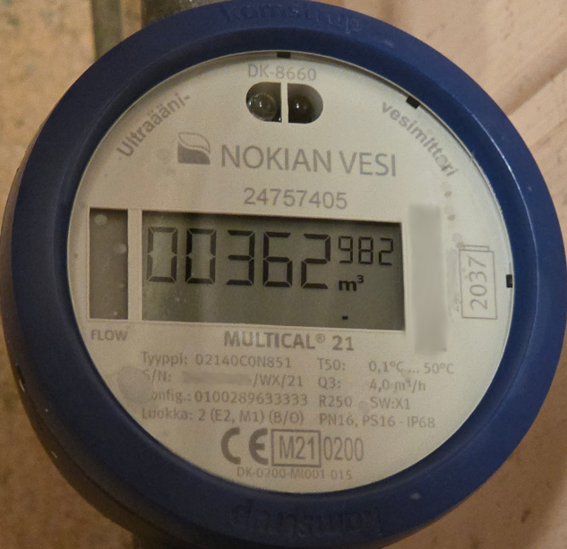
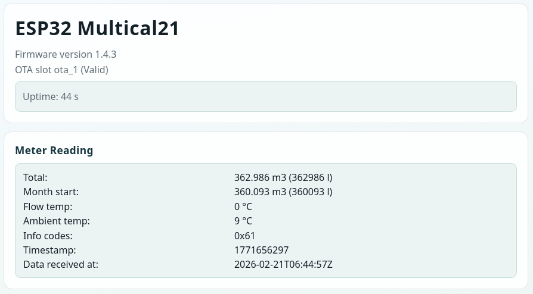
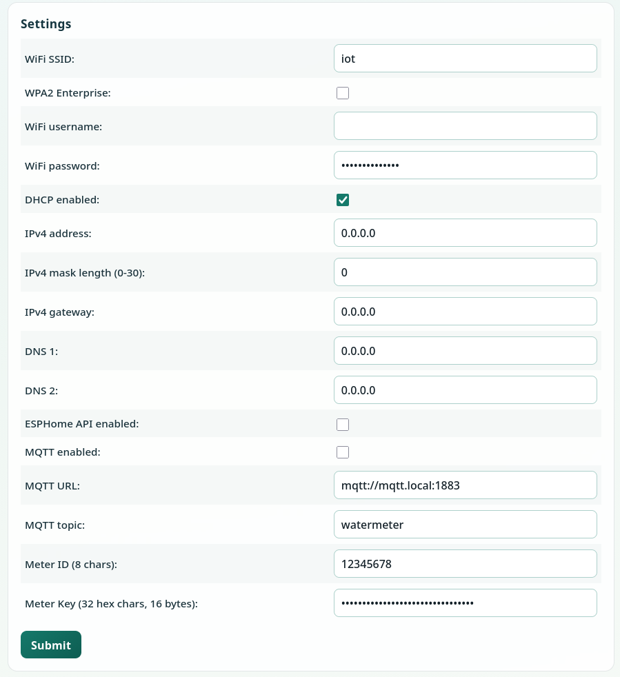
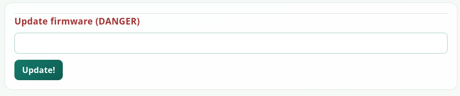

# ESP32 Multical21

A Rust embedded firmware for ESP32-C3 and ESP32-WROOM32 that receives encrypted wireless M-Bus (wMBus)
telegrams from Kamstrup Multical 21 water meters via a CC1101 sub-GHz RF module.
Decoded meter readings are exposed through a web UI, REST API, MQTT, and optional ESPHome native API.
The firmware also provides a fixed AP-mode recovery/configuration path for local setup from a phone.

Runs on Tokio async runtime on top of FreeRTOS.



## Web UI







The HTML is rendered from Askama templates in `templates/`. Static assets live in `static/` and are gzip-compressed
at build time by `build.rs`, then embedded into the firmware image and served with `Content-Encoding: gzip` to reduce
flash usage.

## Hardware

### Components

- **ESP32-C3** (RISC-V)
- **ESP-WROOM-32** (Xtensa ESP32)
- **CC1101** sub-GHz RF transceiver module (configured to 868.950 MHz, 2-FSK)

### Pinout (ESP32-C3 build, feature `esp32-c3`)

| Pin    | Function                             |
|--------|--------------------------------------|
| GPIO4  | SPI SCK                              |
| GPIO5  | SPI MISO                             |
| GPIO6  | SPI MOSI                             |
| GPIO7  | SPI CS (CC1101)                      |
| GPIO10 | CC1101 GDO0                          |
| GPIO8  | Onboard LED (active low)             |
| GPIO9  | Factory settings button (active low) |

### Pinout (ESP-WROOM-32 build, feature `esp-wroom-32`)

| Pin    | Function                             |
|--------|--------------------------------------|
| GPIO18 | SPI SCK                              |
| GPIO19 | SPI MISO                             |
| GPIO23 | SPI MOSI                             |
| GPIO5  | SPI CS (CC1101)                      |
| GPIO4  | CC1101 GDO0                          |
| GPIO2  | Onboard LED (active high)            |
| GPIO0  | Factory settings button (active low) |

The CC1101 is configured for wMBus C1 mode: 868.949708 MHz, 2-FSK modulation, sync word `0x543D`,
48-byte packets. `GDO0` is polled in software; with `IOCFG0=0x01` and `FIFOTHR=0x01`, it rises when
the RX FIFO reaches threshold, after which firmware reads the packet and validates sync bytes.

## Building & Flashing

### Prerequisites

- Rust nightly with `rust-src` (default path in `rust-toolchain.toml`)
- ESP tools: `espflash`, `ldproxy`, `espup`
- Xtensa builds (`ESP-WROOM-32`) also require the `esp` Rust toolchain (`cargo +esp`)

Debian/Ubuntu packages and Rust bootstrap example:

```bash
sudo apt -y install build-essential curl git libssl-dev libudev-dev pkg-config python3-venv clang-18
curl --proto '=https' --tlsv1.2 -sSf https://sh.rustup.rs | sh
chmod 755 rustup.sh
./rustup.sh

. "$HOME/.cargo/env"
rustup toolchain add nightly
espup install

cargo install espmonitor espup ldproxy flip-link cargo-espflash espflash

# optional & useful
cargo install cargo-binutils cargo-embed cargo-flash cargo-generate cargo-update probe-run
```

### Utility Scripts

Optional helper environment file:

```bash
. env.sh   # WIFI_SSID/WIFI_PASS defaults for build-time config
```

The repository provides hardware-specific helpers:

```bash
./flash_c3                             # Build+flash+monitor for ESP32-C3
./flash_wroom32                        # Build+flash+monitor for ESP-WROOM-32

./make_ota_image_c3                    # Build release OTA image -> firmware-c3.bin
./make_ota_image_wroom32               # Build release OTA image -> firmware-wroom32.bin
```

## Configuration

Device configuration is persisted in NVS (Non-Volatile Storage) as a single Postcard-serialized blob
with CRC-32 integrity checking (`CRC_32_ISCSI`), stored under key `cfg`.
The serialized config blob is limited to 256 bytes.
If the NVS entry is missing or fails CRC/deserialization checks, defaults are written automatically on boot.

| Parameter        | Description                           | Default                  |
|------------------|---------------------------------------|--------------------------|
| `wifi_ssid`      | WiFi SSID                             | from `env.sh`            |
| `wifi_pass`      | WiFi password                         | from `env.sh` / empty    |
| `wifi_wpa2ent`   | Use WPA2-Enterprise auth              | false                    |
| `wifi_username`  | WPA2-Enterprise username/identity     | (empty)                  |
| `v4dhcp`         | Use DHCP                              | true                     |
| `v4addr`         | Static IPv4 address                   | 0.0.0.0                  |
| `v4mask`         | Subnet mask bits (0-30)               | 0                        |
| `v4gw`           | Gateway                               | 0.0.0.0                  |
| `dns1`/`dns2`    | DNS servers                           | 0.0.0.0                  |
| `esphome_enable` | Enable ESPHome native API listener    | false                    |
| `mqtt_enable`    | Enable MQTT publishing                | false                    |
| `mqtt_url`       | MQTT broker URL                       | `mqtt://mqtt.local:1883` |
| `mqtt_topic`     | MQTT topic prefix                     | `watermeter`             |
| `meter_id`       | Target meter serial (8 hex chars)     | (empty)                  |
| `meter_key`      | AES-128 decryption key (32 hex chars) | (empty)                  |

Configuration can be changed through the web UI at `http://<device-ip>/` in station mode,
or at `http://10.42.42.1/` in AP mode, or via `POST /conf` with a JSON body.
Changes take effect after an automatic reboot.
`POST /conf` and `GET /reset_conf` return JSON in the form `{"ok": <bool>, "message": "<text>"}`.

Environment variables `WIFI_SSID` and `WIFI_PASS` provide build-time defaults.

## AP Mode Recovery / Local Setup

The firmware includes a fixed AP mode intended for local reconfiguration when the normal station-mode WiFi
credentials are not usable.

- AP SSID: `esp32multical21`
- AP IP address: `10.42.42.1/24`
- Web UI: `http://10.42.42.1/`
- The AP is open (no password)

AP mode is entered by a short press of the board button (`GPIO9` on ESP32-C3, `GPIO0` on ESP32-WROOM-32).
The button request is stored in NVS as a one-shot boot flag and the firmware reboots into AP mode.
On the next normal reboot, AP mode is not retained unless requested again.

In AP mode, the local HTTP configuration UI stays available, but meter reading, MQTT publishing, and ESPHome
native API are disabled.

## LED Behavior

- Normal boot: LED is turned off at async startup
- Valid meter reading: LED blinks for 500 ms
- Button held down: LED blinks while the button remains pressed
- AP mode: LED stays on continuously
- Factory reset trigger reached: LED stays on until reboot

## Home Assistant integration via MQTT

Setup your MQTT broker first.

To your main config `configuration.yaml` you probably want to add:

```
mqtt: !include_dir_list mqtt
```

Add this to your `mqtt` subdirectory, as `watermeter.yaml` or whatever filename you like:

```
sensor:
  - name: "Water Meter Usage"
    unique_id: "water_total"
    state_topic: "watermeter/meter"
    unit_of_measurement: "m³"
    value_template: "{{ value_json.total_m3 }}"
    device_class: water
    state_class: total_increasing
  - name: "Water Meter Month Start"
    unique_id: "water_month_start"
    state_topic: "watermeter/meter"
    unit_of_measurement: "m³"
    value_template: "{{ value_json.month_start_m3 }}"
    device_class: water
    state_class: measurement
  - name: "Water Meter Room Temperature"
    unique_id: "water_temp_room"
    state_topic: "watermeter/meter"
    value_template: "{{ value_json.ambient_temp }}"
    unit_of_measurement: "°C"
  - name: "Water Meter Water Temperature"
    unique_id: "water_temp_water"
    state_topic: "watermeter/meter"
    value_template: "{{ value_json.flow_temp }}"
    unit_of_measurement: "°C"
  - name: "Water Meter uptime"
    unique_id: "water_uptime"
    state_topic: "watermeter/uptime"
    value_template: "{{ value_json.uptime }}"
    unit_of_measurement: "s"
```

## HTTP API

Served by Axum on port 80.
The same API is available in AP mode at `http://10.42.42.1/`.

| Method | Path           | Description                                                                    |
|--------|----------------|--------------------------------------------------------------------------------|
| GET    | `/`            | Web configuration UI (Askama template)                                         |
| GET    | `/favicon.ico` | Favicon, served from build-time gzip-compressed embedded asset                 |
| GET    | `/form.js`     | Web UI JavaScript, served from build-time gzip-compressed embedded asset       |
| GET    | `/index.css`   | Web UI stylesheet, served from build-time gzip-compressed embedded asset       |
| GET    | `/uptime`      | `{"uptime": <seconds>}`                                                        |
| GET    | `/conf`        | `{"ok": true, "config": {...}}`                                                |
| POST   | `/conf`        | Save config and reboot. JSON response: `{"ok": <bool>, "message": "<text>"}`   |
| GET    | `/reset_conf`  | Factory reset and reboot. JSON response: `{"ok": <bool>, "message": "<text>"}` |
| GET    | `/meter`       | Current meter reading as JSON (or `{"status":"no reading"}` if empty)          |
| POST   | `/fw`          | OTA firmware update (form field `url`)                                         |

CORS preflight (`OPTIONS`) is implemented for `/conf` and `/fw`.
Browsers request the static endpoints normally; the firmware replies with precompressed gzip payloads plus the
appropriate `Content-Type` and `Content-Encoding: gzip` headers.

## OTA Firmware Update

The flash is partitioned into two 1984 KB OTA slots (`ota_0`, `ota_1`). OTA update downloads are currently HTTP-only.
To update:

1. Host the new firmware binary on an HTTP server
2. POST to `/fw` with form field `url` pointing to the binary
3. The device downloads the firmware, writes it to the inactive OTA slot, and reboots
4. On boot, the new firmware calls `mark_running_slot_valid()`
   — if it crashes before doing so, the bootloader automatically rolls back to the previous slot

### Partition Table

```
nvs,      data, nvs,   0x9000,  0x4000   (16 KB)
otadata,  data, ota,   0xd000,  0x2000   (8 KB)
phy_init, data, phy,   0xf000,  0x1000   (4 KB)
ota_0,    app,  ota_0, ,        1984K
ota_1,    app,  ota_1, ,        1984K
```

## Watchdogs & Recovery

- **Reset / setup button**:
  - Short press: reboot into AP mode for local manual configuration
  - Long press: hold for about 5 seconds to factory-reset configuration and reboot
  - While held, the LED blinks; once factory reset starts, the LED stays on until reboot
  - Button GPIO is `GPIO9` on ESP32-C3 and `GPIO0` on ESP32-WROOM-32
- **WiFi watchdog**: If initial WiFi connection fails within 30 seconds, the device reboots
- **NTP watchdog**: If SNTP sync does not complete within ~60 seconds after WiFi, the device reboots
- **Ping watchdog**: Every 5 minutes, pings the gateway 3 times. If all fail, reboots
- **Radio watchdog**: If no packet is received for 10 minutes, the CC1101 is reinitialized
- **OTA rollback**: If new firmware fails to mark itself valid, the bootloader reverts to the previous slot

## Build Configuration

- **Rust edition**: 2024 (nightly)
- **Hardware features**:
    - `esp32-c3` (default)
    - `esp-wroom-32`
- **Conditional compilation**:
    - GPIO mapping is selected with `#[cfg(feature = "...")]` in `src/bin/esp32multical21.rs`
    - `esp32-c3` maps button/SPI/GDO0/LED to GPIO9/4/6/5/7/10/8
    - `esp-wroom-32` maps button/SPI/GDO0/LED to GPIO0/18/23/19/5/4/2
    - LED polarity is target-specific: active low on `esp32-c3`, active high on `esp-wroom-32`
- **Release profile**: `opt-level = "z"` (size-optimized), fat LTO, single codegen unit
- **ESP-IDF**: v5.4.3, main task stack 20 KB, FreeRTOS tick rate 1 kHz
- **Clippy**: `future-size-threshold = 128` to catch oversized futures

### Meter Reading Response

```json
{
  "total_l": 362705,
  "month_start_l": 360093,
  "total_m3": 362.705,
  "month_start_m3": 360.093,
  "flow_temp": 1,
  "ambient_temp": 10,
  "info_codes": 97,
  "timestamp": 1771439618,
  "timestamp_s": "2026-02-18T18:33:38Z"
}
```

The web UI polls `/uptime` and `/meter` every 30 seconds and renders a live dashboard.

## MQTT

When enabled, the device connects to the configured MQTT broker and publishes on new meter data (checked every 10
seconds):

- **`{topic}/uptime`** — `{"uptime": <seconds>}`
- **`{topic}/meter`** —
  `{"total_l": <u32>, "month_start_l": <u32>, "total_m3": <f32>, "month_start_m3": <f32>, "flow_temp": <u8>, "ambient_temp": <u8>, "info_codes": <u8>, "timestamp": <i64>, "timestamp_s": <String>}`

Volumes are published both in liters and cubic meters.
MQTT uses QoS 1 for publishes; `{topic}/meter` is retained and `{topic}/uptime` is non-retained.
The MQTT client ID is derived from the device MAC address: `esp32multical21_XXXXXXXXXXXX`.
MQTT is disabled in AP mode.

## ESPHome Native API

When `esphome_enable=true`, the firmware opens an ESPHome-compatible native API listener on TCP port `6053`.

- Plaintext-only implementation (Noise encryption key setup is rejected)
- Responds to hello/device-info/list-entities/subscribe-states/ping/disconnect flows
- Exposes `uptime` plus meter fields (`total_l`, `month_start_l`, `total_m3`, `month_start_m3`, temperatures, info
  codes, timestamps)
- `timestamp_s` is exported as a text sensor; numeric fields are exported as sensors

ESPHome native API is disabled in AP mode.

## wMBus Protocol

The CC1101 radio listens for wireless M-Bus C1 mode telegrams at 868.949708 MHz. When a packet arrives:

1. **FIFO threshold signal** — Firmware polls `GDO0` and detects packet-ready state when FIFO reaches threshold
2. **Sync validation** — Firmware checks the first bytes are the C1 sync `0x54 0x3D`
3. **Meter ID filtering** — Only packets matching the configured meter serial are processed
4. **AES-128-CTR decryption** — The 16-byte IV is constructed from the frame header fields (manufacturer, address,
   communication control, session number)
5. **CRC-16 validation** — EN 13757 polynomial `0x3D65` verifies payload integrity
6. **Payload parsing** — Multical 21 compact (CI `0x79`) or long (CI `0x78`) frame format extracts volume, temperature,
   and status data

### Frame Structure

```
Over the air:
[Preamble 0x543D] [L] [C] [M-field 2B] [A-field 6B] [CI] [CC] [ACC] [SN 4B] [Encrypted Payload] [CRC]

After decryption:
[CRC-16 2B] [CI] [Info] ... [Total Volume 4B] ... [Month-start Volume 4B] ... [Flow Temp] [Ambient Temp]
```

The meter ID is encoded in little-endian BCD on the wire
— a meter printing serial `12345678` transmits bytes `[0x78, 0x56, 0x34, 0x12]`.

## Architecture

The binary entry point (`src/bin/esp32multical21.rs`) initializes hardware, loads config and AP-mode boot flags from
NVS, and runs seven concurrent tasks under `tokio::select!` (service tasks wait until networking is up):

```
┌─────────────────────────────────────────────────────────────────┐
│                    Tokio Runtime (single-threaded)               │
│                                                                 │
│  poll_reset()     Uptime counter, AP/factory button handler     │
│  read_meter()     CC1101 RX → wMBus decrypt → meter parse       │
│                   (disabled in AP mode)                         │
│  run_mqtt()       Publish meter data to MQTT broker (10s check) │
│                   (disabled in AP mode)                         │
│  run_api_server() Axum HTTP server (port 80)                    │
│  run_esphome_api() ESPHome native API server (port 6053)         │
│                   (disabled in AP mode)                         │
│  wifi_loop.run()  WiFi station/AP-mode manager                  │
│  pinger()         Ping gateway every 5 min, reboot on failure   │
└─────────────────────────────────────────────────────────────────┘
                              │
              ┌───────────────┴───────────────┐
              │  Shared State (Arc<MyState>)   │
              │  Mostly RwLock fields for      │
              │  config/wifi/meter + atomic    │
              │  API request counter            │
              └───────────────────────────────┘
```

All tasks share a single `Arc<Pin<Box<MyState>>>` instance with mostly `RwLock`-protected fields;
`api_cnt` is an atomic counter.

### Source Modules

| File                         | Purpose                                                    |
|------------------------------|------------------------------------------------------------|
| `build.rs`                   | Build metadata plus gzip compression of embedded static assets |
| `static/`                    | Web UI static files (`favicon.ico`, `form.js`, `index.css`)   |
| `templates/`                 | Askama HTML templates                                         |
| `src/bin/esp32multical21.rs` | Entry point, hardware init, task orchestration             |
| `src/lib.rs`                 | Re-exports, common types, firmware/AP/LED constants        |
| `src/state.rs`               | `MyState` struct — shared concurrent state and LED control |
| `src/config.rs`              | `MyConfig` struct — NVS serialization/deserialization      |
| `src/radio.rs`               | CC1101 SPI driver — register config, packet RX             |
| `src/wmbus.rs`               | wMBus C1 frame parsing, AES-128-CTR decryption             |
| `src/multical21.rs`          | Kamstrup Multical 21 payload parser                        |
| `src/measure.rs`             | Radio RX loop — waits for networking and parses meter frames |
| `src/mqtt_sender.rs`         | MQTT client lifecycle and publishing                       |
| `src/apiserver.rs`           | Axum HTTP routes, web UI, OTA updates                      |
| `src/esphome_api.rs`         | ESPHome native API implementation                          |
| `src/wifi.rs`                | WiFi station/AP-mode state machine                         |

### Startup Sequence

1. Initialize ESP-IDF (logging, eventfd VFS, system event loop)
2. Load `MyConfig` from NVS (or save defaults if first boot)
3. Read and clear the one-shot AP-mode boot flag from NVS
4. Initialize OTA subsystem, mark running slot valid (prevents rollback)
5. Configure SPI bus and CC1101 radio, set up GPIO for reset button and onboard LED
6. Create WiFi driver and shared `MyState`
7. Launch Tokio runtime with seven concurrent tasks
8. Enter station mode or AP mode depending on the boot flag, then start the corresponding services

## License

MIT

Author: Sami J. Mäkinen <sjm@iki.fi>

This is originally based on C++ code here: https://github.com/pthalin/esp32-multical21

Thanks to __pthalin__ for the effort.
